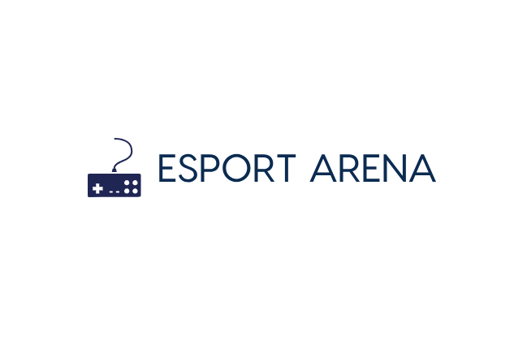
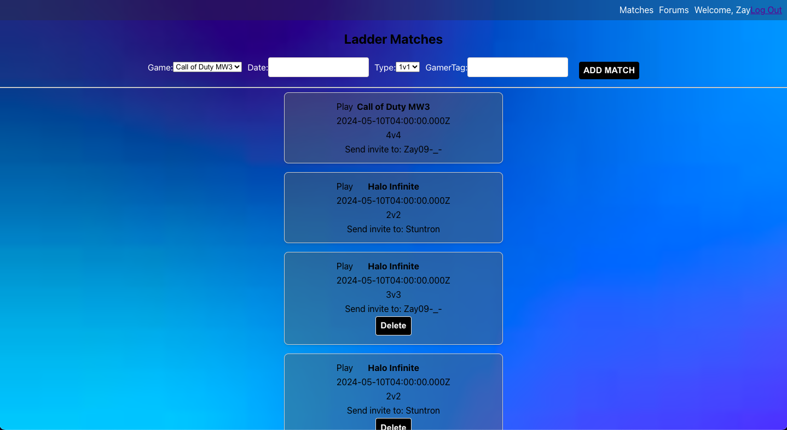
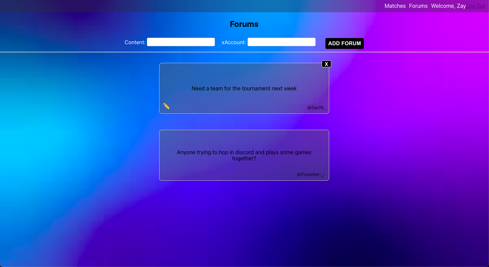
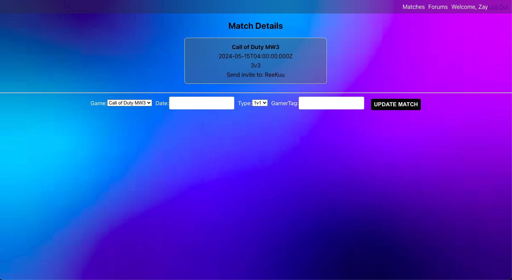

  

Esport Arena is a gaming app for all gamers ranging from friends that want to have a little more competition to professionals at the top of their game. Gamers can choose across a selection of current supported games to post matches and/or accept others' to setup competitions ranging from 1v1 to 4v4. Gamers can also post on the forum page if they are looking to meet new friends or have a questions regarding the site.

## :sparkles: How it Works:
**Sign Up**: Create your account

**Explore**: Browse ladder matches and forum posts from other gamers, accept and play matches, and connect with fellow gamers who share your love for the game.

**Game On**: You think you got what it takes? Signup now and begin your friendly or maybe slightly more serious competition across a selection of games such as Call of Duty, Halo, Fortnite, and more to come...

# Screenshots

# :hammer_and_wrench: Languages and Tools :

&nbsp;&nbsp;
&nbsp;&ensp;
&nbsp;&ensp;
&nbsp;&ensp;
&nbsp;&ensp;
&nbsp;&ensp;
&nbsp;&ensp;
&nbsp;&ensp;
&nbsp;&ensp;
&nbsp;
&nbsp;

# Getting Started
- [START WANDERING](http://esports-arena-70ad561b1774.herokuapp.com/)
- [TRELLO](https://trello.com/b/MK0FRfKp/esport-arena)
- [WIREFRAME](https://www.figma.com/file/a93XCUR77sfCYEclFe0FuZ/Esport-Arena-Wireframes?type=design&node-id=0-1&mode=design&t=YBYcUcL1qKLcuiBT-0)

# :computer: Developers
- [Isaiah Miller](https://github.com/Isaiahmill14)

# :loop: Next Steps
- I want to make a store where users can buy credits to enter tournaments with an entry fee

- I want users to be able to gain or lose experience based on their match results, which will in turn give all users a rank they can show off and compare against others

- I want users to be able to create and customize their own profiles, that allows them to show off their trophies from tournaments wins, user rank, etc...

- I want other users to be able to reply and interact with others' forum posts like an active forum page

&nbsp;
 

 

